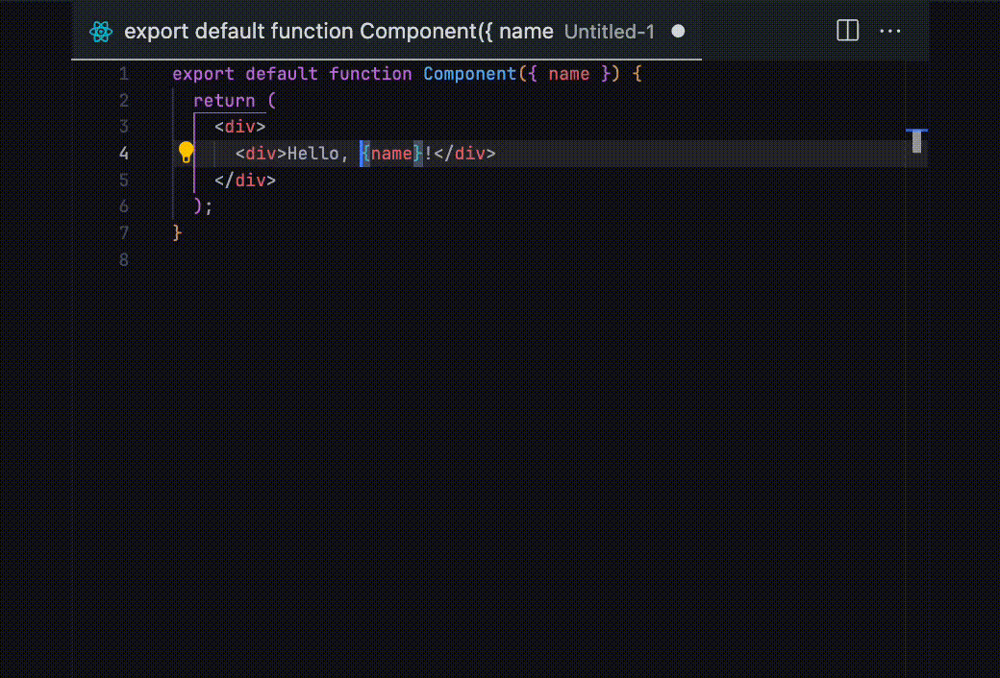
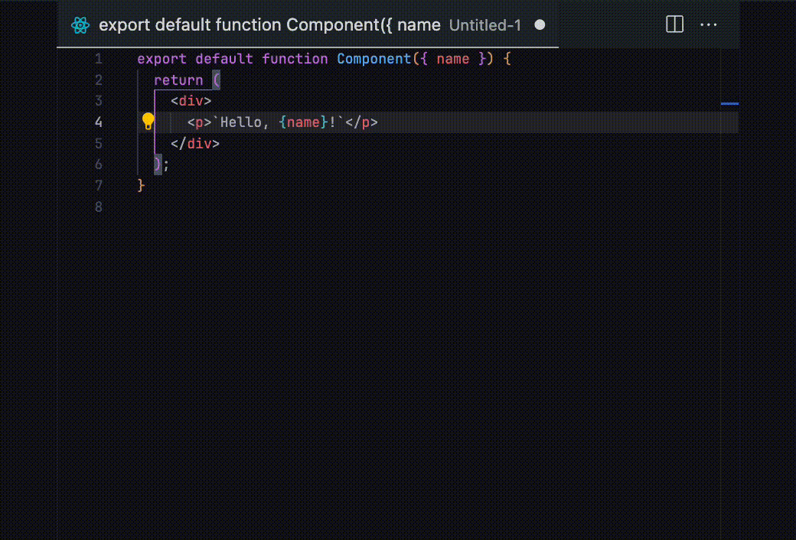
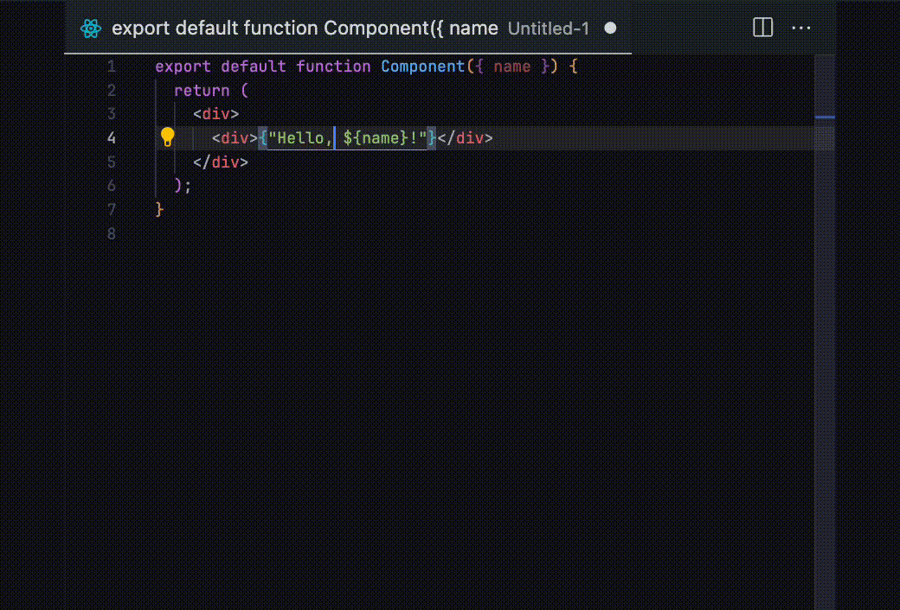

# VSCode Sandwich

A Visual Studio Code extension inspired by [vim-sandwich](https://github.com/machakann/vim-sandwich) that provides operations to add, delete, and replace surroundings like quotes (single `'`, double `"`, backtick `` ` ``), brackets (parentheses `()`, braces `{}`, square brackets `[]`, angle brackets `<>`), and HTML/XML tags.

## Overview

This extension adapts the core concept of vim-sandwich to VSCode's editing environment. It is not a complete port or fully compatible implementation, but rather a VSCode-native approach to text surrounding operations.

## Features

- **Add surroundings** to text objects
   - Multiple selection modes:
      - `_`: Entire line
      - `s`: Current selection
      - `it`: Inside HTML/XML tags
      - `at`: Around HTML/XML tags (including the tags)
      - `st`: Self-closing tags
  
   
- **Delete surroundings** from text objects
   
- **Replace surroundings** with different surroundings
   

## Usage

The extension uses a command-based workflow:

1. Trigger the extension (default: `Cmd-k + s` on macOS, `Ctrl-k + s` on Windows/Linux)
2. Select operation: `a` (add), `d` (delete), or `r` (replace)
3. Select target range (for add operation)
4. Select surrounding type


## Installation

```
1. Open VS Code
2. Go to Extensions (Cmd+Shift+X / Ctrl+Shift+X)
3. Search for "VSCode Sandwich"
4. Install
```

## Configuration

The extension can be configured through VS Code settings:

```json
"vscodeSandwich.enterToConfirm": false,
"vscodeSandwich.highlightColor": "rgba(255, 255, 0, 0.3)"
```

### Configuration Options

#### `vscodeSandwich.enterToConfirm`

Controls whether the extension requires pressing Enter to confirm each selection or responds immediately when a key is pressed:

- `false` (default): The extension responds immediately when you press a key, without waiting for Enter. This allows for faster workflows but may lead to accidental selections if you press the wrong key.
- `true`: After selecting an operation (a/d/r) or range type, you need to press Enter to confirm and proceed to the next step. This is safer as it prevents accidental selections.

For example, with `enterToConfirm: true`, the workflow would be:
1. Press `Cmd-k + s`
2. Press `a` then `Enter`
3. Press `s` then `Enter`
4. Press `"` then `Enter`

With `enterToConfirm: false`, the workflow would be:
1. Press `Cmd-k + s`
2. Press `a` (immediately proceeds to next step)
3. Press `s` (immediately proceeds to next step)
4. Press `"` (immediately applies the operation)

#### `vscodeSandwich.highlightColor`

Sets the color used for highlighting selected ranges. The default is `"rgba(255, 255, 0, 0.3)"` (semi-transparent yellow).


## License

[MIT](LICENSE)

# Memo

How to publish the extension.
ref: https://code.visualstudio.com/api/working-with-extensions/publishing-extension

1. Access Azure DevOps (https://dev.azure.com/{Your_Organization}) to get the PAT
2. Update the version in package.json
3. Run `vsce package <version> --no-dependencies`
4. Run `vsce publish <version> --no-dependencies`
