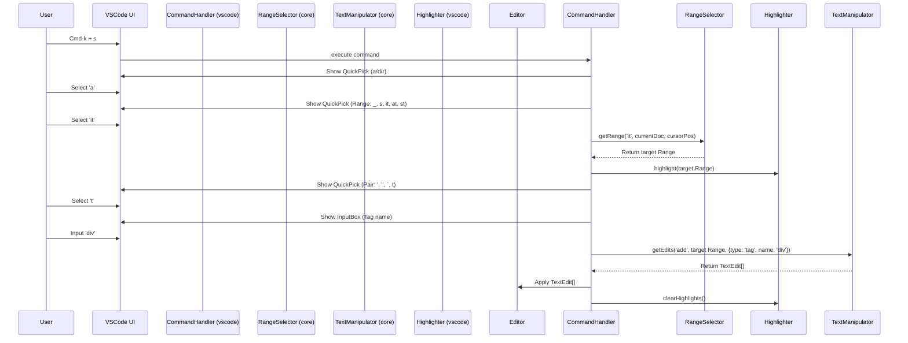

# VSCode Sandwich 拡張機能 設計計画書 (AI作成)

## 1. 概要

[vim-sandwich](https://github.com/machakann/vim-sandwich) のコンセプトをVSCode拡張機能として再現する。
特定のキー操作（デフォルト: Cmd-k + s）をトリガーに、テキストオブジェクトに対して囲み文字/タグの追加(add)、削除(delete)、置換(replace)を行う。

## 2. 機能要件

### 2.1. 基本操作フロー

1.  **トリガー:** `Cmd-k + s` (設定変更可能)
2.  **操作選択:** `a` (追加), `d` (削除), `r` (置換) を入力 (Enterキー or 即時反応)
3.  **対象範囲選択 (a の場合):**
    *   `_`: 行全体
    *   `s`: 現在の選択範囲
    *   `it`: タグの内側 (例: `<p>ここ</p>`)
    *   `at`: タグ全体 (例: `<p>ここ</p>`)
    *   `st`: 自己閉じタグ (例: ``)
4.  **ペア/ターゲット選択:**
    *   `a` (追加): 追加するペア (`'`, `"`, `` ` `` , `t` -> タグ名入力) を選択
    *   `d` (削除): 削除するペア/タグ (`'`, `"`, `` ` `` , `t`) を選択
    *   `r` (置換): 置換元のペア/タグ (`'`, `"`, `` ` `` , `t`) を選択
5.  **置換後のペア選択 (r の場合):**
    *   置換後のペア (`'`, `"`, `` ` `` , `t` -> タグ名入力) を選択
6.  **実行:** 選択された操作と範囲に基づき、テキストを編集する。

### 2.2. UX要件

*   操作中の選択範囲や対象候補を視覚的にハイライトする。
*   操作の各ステップで、ユーザーに入力を促すガイドを表示する (例: ステータスバー、Quick Pick)。
*   設定により、Enterキー入力待機か即時反応かを選択可能にする (デフォルト: Enter待機)。

### 2.3. その他

*   TypeScript, HTML, JSX/TSX などの主要な言語に対応する。
*   `.clinerules` に従い、機能分割、型重視、副作用分離を意識した設計とする。
*   テストコードを記述する (特にコアロジック)。

## 3. アーキテクチャ設計

### 3.1. ファイル構成案

```
.
├── docs/
│   ├── first-design-ja.md
│   └── design-plan-by-ai.md  <-- このファイル
├── src/
│   ├── extension.ts          # 拡張機能のエントリーポイント、コマンド登録
│   ├── core/                 # 主要ロジック (VSCode API非依存)
│   │   ├── index.ts
│   │   ├── text-manipulator.ts # テキスト編集処理 (追加/削除/置換)
│   │   ├── range-selector.ts   # 範囲選択ロジック (_, s, it, at, st)
│   │   └── types.ts            # コアロジックの型定義
│   ├── vscode/               # VSCode API 依存処理
│   │   ├── index.ts
│   │   ├── command-handler.ts  # コマンド実行、UI操作 (QuickPick, InputBox)
│   │   ├── highlighter.ts      # 選択範囲/候補のハイライト処理
│   │   └── config.ts           # 設定値の読み込み
│   ├── types/                # グローバルな型定義 (必要であれば)
│   │   └── index.ts
│   └── test/                 # テストコード
│       ├── core/
│       │   ├── text-manipulator.test.ts
│       │   └── range-selector.test.ts
│       └── vscode/
│           └── command-handler.test.ts # (可能な範囲で)
├── package.json
├── tsconfig.json
└── ... (その他設定ファイル)
```

### 3.2. 主要コンポーネントと責務

*   **`extension.ts`**:
    *   拡張機能のアクティベート、コマンド (`vscode-sandwich.execute`) の登録。
    *   `CommandHandler` の初期化と実行。
*   **`CommandHandler` (`vscode/command-handler.ts`)**:
    *   コマンド実行時のエントリーポイント。
    *   VSCode の Quick Pick や Input Box を使用してユーザー入力を受け付ける (操作、範囲、ペア/タグ)。
    *   `RangeSelector` を呼び出して対象範囲を特定。
    *   `TextManipulator` を呼び出してテキスト編集を実行。
    *   `Highlighter` を呼び出して視覚的なフィードバックを提供。
    *   `Config` から設定値を読み込む。
*   **`RangeSelector` (`core/range-selector.ts`)**:
    *   与えられた入力 (`_`, `s`, `it`, `at`, `st`) とエディタの状態に基づき、操作対象のテキスト範囲 (Range) を計算する純粋な関数。
    *   HTML/XML 解析が必要な場合は、シンプルな正規表現または VSCode API (Language Server など) を利用 (初期は正規表現を検討)。
*   **`TextManipulator` (`core/text-manipulator.ts`)**:
    *   与えられた操作タイプ、範囲、ペア/タグ情報に基づき、適用すべきテキスト編集 (TextEdit) のリストを生成する純粋な関数。
*   **`Highlighter` (`vscode/highlighter.ts`)**:
    *   操作中に選択範囲や候補を一時的にハイライトするための Decoration API を利用。
*   **`Config` (`vscode/config.ts`)**:
    *   `package.json` の `contributes.configuration` で定義された設定値を読み込む。

### 3.3. 処理フロー (Mermaid)


*(注: 上記は 'add' -> 'it' -> 'tag' の場合の例)*

## 4. 技術的考慮事項

*   **HTML/XML 解析:** `it`, `at`, `st` の実装には構文解析が必要。初期は正規表現での実装を試みるが、複雑なネストや属性に対応するには限界がある。将来的には VSCode の Language Server Protocol (LSP) や外部ライブラリ (例: `htmlparser2`) の利用を検討する。VSCode API に組み込みの解析機能があれば活用する。
*   **状態管理:** 操作は複数のステップに分かれるため、ステップ間の状態 (選択された操作、範囲など) を管理する必要がある。シンプルな実装としては、`CommandHandler` 内で変数を保持し、非同期関数 (`async/await`) の呼び出しチェーンで情報を引き継ぐ。複雑化する場合は、状態管理パターン (例: 有限状態マシン) の導入も検討。
*   **パフォーマンス:** 大規模なファイルでの範囲選択やテキスト編集が遅延しないように注意する。特に正規表現のパフォーマンスに気をつける。
*   **エラーハンドリング:** 不正な入力や予期せぬエディタの状態 (範囲が見つからない等) を適切に処理し、ユーザーに分かりやすいエラーメッセージを表示する。
*   **言語対応:** 初期は主要な言語 (Plain Text, TypeScript, JavaScript, HTML, CSS, JSON, Markdown) での動作を確認する。言語ごとにペアの候補を変える (例: HTML では `t` を優先的に表示)。
*   **設定:** 即時反応の有効/無効、デフォルトのペア候補などを設定可能にする。
*   **テスト:** `core` 部分は VSCode API に依存しないため、単体テストを容易に記述できる。`range-selector` や `text-manipulator` のロジックを重点的にテストする。`vscode` 部分は結合テストや手動テストでカバーする。

## 5. 開発ステップ (案)

1.  **環境構築:** プロジェクト初期設定、リンター、フォーマッター、テスト環境の整備。
2.  **コアロジック実装 (`core`):**
    *   型定義 (`core/types.ts`)
    *   範囲選択ロジック (`range-selector.ts`) の実装とテスト (`_`, `s` から開始)。
    *   テキスト編集ロジック (`text-manipulator.ts`) の実装とテスト (基本的なペア追加/削除から開始)。
3.  **VSCode連携実装 (`vscode`):**
    *   コマンド登録 (`extension.ts`)。
    *   基本的なUI処理 (`command-handler.ts`) - QuickPick で操作選択まで。
    *   コアロジックとの連携 (範囲選択、テキスト編集の呼び出し)。
4.  **機能拡張:**
    *   `it`, `at`, `st` の範囲選択実装。
    *   タグ (`t`) の追加/削除/置換機能実装。
    *   置換 (`r`) 操作の実装。
    *   ハイライト機能 (`highlighter.ts`) 実装。
    *   設定機能 (`config.ts`) 実装。
5.  **テスト拡充:** 結合テスト、エッジケースのテスト。
6.  **ドキュメント整備:** README、使い方ガイド。
7.  **リリース準備:** `package.json` の整備、`vsce` でのパッケージング。

## 6. 型定義の具体化 (要望反映)

`core/types.ts` に以下のような型を追加定義することを検討する。

```typescript
// 操作の種類
export type OperationType = 'add' | 'delete' | 'replace';

// 範囲選択の種類
export type RangeType = '_' | 's' | 'it' | 'at' | 'st';

// ペアの種類 (基本)
export type BasicPairType = "'" | '"' | '`';

// ペアの種類 (タグ)
export type TagPairType = { type: 'tag'; name: string };

// ペアの種類 (全体)
export type PairType = BasicPairType | TagPairType;

// RangeSelector が返す情報 (例)
export type SelectionRangeResult = {
  range: vscode.Range; // VSCode の Range オブジェクト
  // 必要に応じて追加情報 (例: 選択されたテキスト)
};

// TextManipulator が返す情報 (VSCode API の TextEdit を想定)
export type TextEditResult = vscode.TextEdit[];

// CommandHandler がステップ間で引き回す可能性のある状態 (例)
export type CommandState = {
  operation?: OperationType;
  targetRange?: vscode.Range;
  sourcePair?: PairType; // 置換元や削除対象
  destinationPair?: PairType; // 追加先や置換先
};
```
*(注: `vscode.Range` や `vscode.TextEdit` は実際には `core` に直接含めず、抽象化するか `vscode` 層で変換することを検討)*
